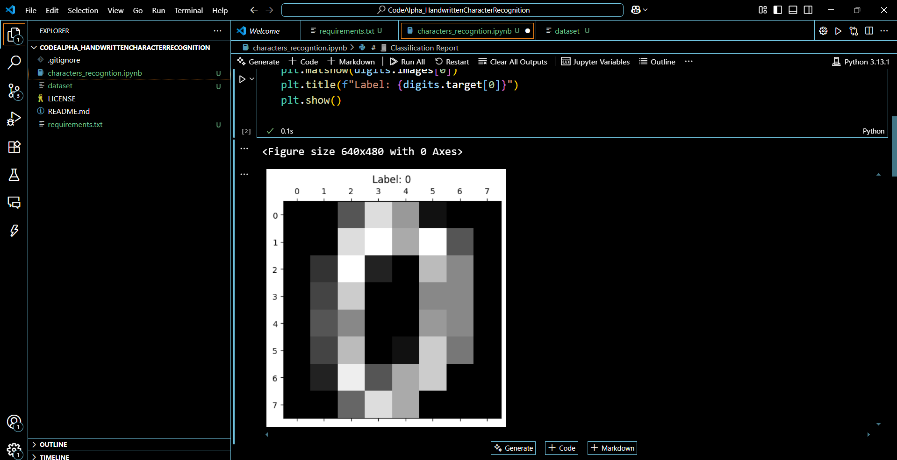
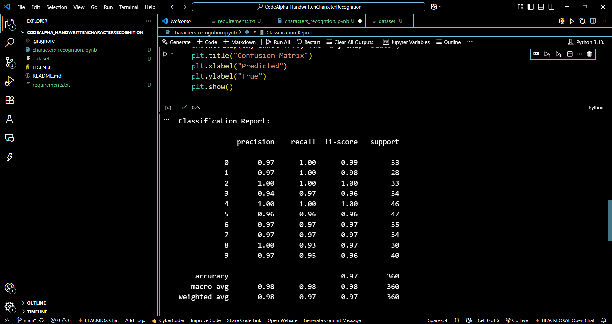

# 🖋️ Handwritten Character Recognition

This project uses machine learning to recognize handwritten English characters (A-Z) from images. It is built using classical machine learning techniques and focuses on feature extraction and classification using a Random Forest model.

---

## 🎯 Objective

To build a model that can accurately classify handwritten alphabet characters from image data.

---

## 🧠 Approach

1. Load the dataset from CSV format.
2. Visualize the distribution of character samples.
3. Preprocess data (normalize pixel values).
4. Train a Random Forest classifier.
5. Evaluate performance using accuracy, classification report, and confusion matrix.
6. Visualize model results.

---

## 📂 Dataset Details

- Source: Kaggle [A-Z Handwritten Characters](https://www.kaggle.com/datasets/sachinpatel21/az-handwritten-alphabets-in-csv-format)
- Format: CSV file with 785 columns (1 label + 784 pixels)
- Each row = 1 image (28x28 pixels, grayscale)
- Classes: 26 (A-Z), represented as labels 0–25

---

## 🧾 Features

- 🟡 Input Images: 28x28 grayscale, flattened to 784 values
- 🔠 Labels: Integers 0–25 (representing A–Z)
- 🧮 Total Samples: 372,450 (train) + 124,000 (test)

---

## 📸 Screenshots

### 🔢 Digit Sample Visualization
Displays a few sample digits from the dataset used for training the model.  


---

### 📊 Confusion Matrix Visualization
Shows the confusion matrix after predictions.  


---

### 📝 Classification Report Output
Displays precision, recall, and f1-score for each class.  


---

## 📦 Requirements

Install dependencies using:

```bash
pip install -r requirements.txt
requirements.txt:

nginx
Copy
Edit
numpy
pandas
matplotlib
seaborn
scikit-learn
🖥️ How to Run
Clone this repository:

bash
Copy
Edit
git clone https://github.com/gaurav19-hack/CodeAlpha_HandwrittenCharacterRecognition
cd CodeAlpha_HandwrittenCharacterRecognition
Launch the Jupyter Notebook:

bash
Copy
Edit
jupyter notebook handwritten_character_recognition.ipynb


